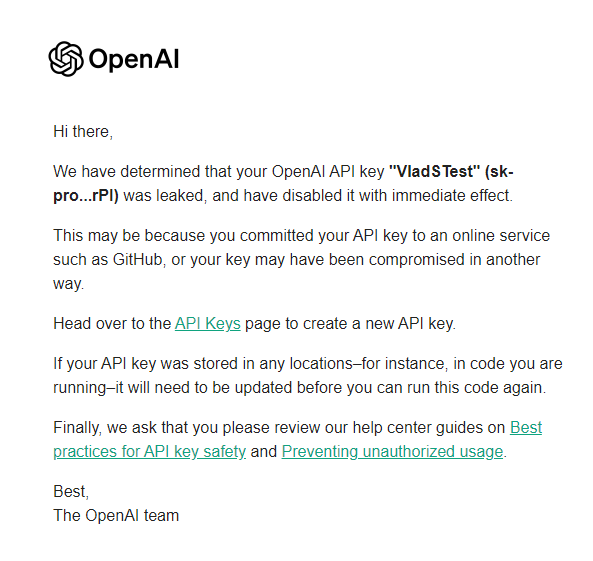

# Telegram bot

This app was created for creating car insurance online and providing informational assistance online.

## Features

- Documents upload and real-time processing
- Issuance of insurance policy in a short time
- Communication with ChatGPT on related topics

## Telegram bot

- Username: [Vlad_CarInsuranceBot](https://t.me/Vlad_CarInsuranceBot)
- A short video demonstrating the bot in the main directory
## Project

- Configuration is stored in `appsettings.json`, replace info if necessary
- ApiKey for OpenAI is already invalid because of github security (so project does not work properly with requests to OpenAI)

